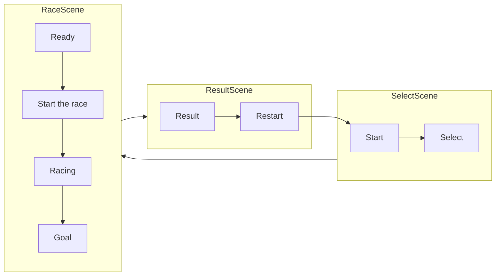

# PimUnity2024Autumn

## About this repo
this for pim's party for developing game with unity in autumn 2024.

## Attention for dev
you need ready unity in version "2022.3.45f1".

Must not push with other unity versions.

## Design

## Specification of Record.json

{
  "Record":
  [
    {
      "RaceID":int,
      "StartTime":Date,
      "GoalTime":Date,
      "RapTime":float
    },
  ]
}
